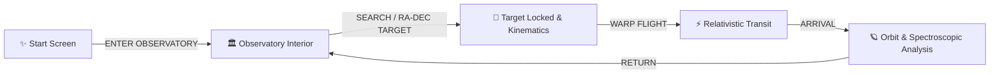

<div align="center">

# 🌌 ASTRO OBSERVATORY 🔭

### *Interactive 3D Deep-Space Observatory & Procedural Cosmos Engine*

[](https://nextjs.org/)
[](https://react.dev/)
[](https://threejs.org/)
[](https://docs.pmnd.rs/react-three-fiber)
[](https://tailwindcss.com/)
[](https://api.nasa.gov/)
[](https://vitest.dev/)

<p align="center">
  <b>Step inside an active astronomical research station, aim high-precision equatorial telescopes across celestial coordinates, and initiate warp-speed transit to explore exoplanets, stars, black holes, quasars, and nebulae powered by real scientific data.</b>
</p>

---

[🪐 Live Experience](#-experience-flow) •
[✨ Features](#-key-features) •
[🔭 Procedural Engine](#-procedural-celestial-engine) •
[📡 Science & Data](#-scientific-data-sources) •
[🛠️ Quickstart](#%EF%B8%8F-getting-started) •
[🏗️ Architecture](#%EF%B8%8F-system-architecture)

---

</div>

<br/>

## 🌌 Experience Flow



1. **Station Entry**: Approach the hilltop observatory through moonlight-lit terrain, enter through the automatic double doors, and take station at the main equatorial pier.
2. **Coordinate Targeting**: Search catalogued celestial objects (or input arbitrary Right Ascension & Declination coordinates). The telescope mount pitches and the slotted dome rotates in synchronized kinematics to align with the sky coordinates.
3. **Relativistic Warp Flight**: Peer through the ocular reticle and initiate warp flight—streaking across thousands of light-years with dynamic FOV distortion and relativistic velocity calculations.
4. **Deep-Space Orbit & Analysis**: Arrive in close orbit around the procedurally-rendered celestial body with full OrbitControls, physical lighting, spectral classification, habitability assessments, and localized scientific dossiers.

<br/>

---

## ✨ Key Features

### 🔭 Interactive 3D Observatory Interior
- **Equatorial Mount Kinematics**: Realistic telescope altitude and azimuth slewing mapped accurately to astronomical declinations and right ascensions.
- **Slotted Rotating Dome**: Custom dome geometry with a parallel-slit shutter tracking the telescope's line of sight to open space.
- **Atmospheric Research Station**: Night-vision preservation red lighting, control consoles, diagnostic readouts, equipment shelves, and external terrain with procedural vegetation and rock formations.

### ⚡ Relativistic Warp Transit
- **Kinetic Warp Velocity**: Speed and transit duration scale logarithmically with real astronomical distance ($3\text{s}$ for local systems up to $8\text{s}$ for distant deep-sky objects).
- **Zero-Stutter Performance**: High-performance GPU-driven warp lines and direct DOM ref-driven HUD ensuring buttery-smooth 60–120 FPS during warp acceleration.

### 🎨 Precision Industrial Utilitarian Aesthetic
- **Cyber-Observatory Dark Mode**: Crafted with deep-space palette (`#010A14`, `#020B18`, `#4FACFE`, `#FF6B35`).
- **Precision HUD Overlays**: Reticles, coordinate readouts, spectral chip badges, corner reticle brackets, and scanline shaders.
- **Multilingual Telemetry**: Full internationalization supporting **English** and **Bosanski (Bosnian)** with localized astronomical terminology.

<br/>

---

## 🪐 Procedural Celestial Engine

Every celestial body is dynamically rendered with custom GLSL shaders and particle volumetric simulations parameterized directly by real scientific metadata:

| Celestial Type | Visual Engine & Physical Simulation |
| :--- | :--- |
| **🌍 Exoplanets & Planets** | Multi-octave 3D Simplex noise terrain, dynamic liquid oceans, polar ice calculation, procedural cloud layers, atmospheric Fresnel rim scattering, and banded ring systems (e.g. Saturn, Neptune Dark Spot, Jupiter Red Spot, and Saturn Polar Hexagon). |
| **⭐ Stars & Binaries** | Convection-cell surface GLSL shaders, blackbody temperature-accurate color mapping ($1,000\text{K} - 40,000\text{K}$), limb darkening, dynamic corona particle shells, and barycentric orbits for binary/multiple star systems. |
| **🕳️ Black Holes** | True-occlusion event horizon sphere, Doppler-beamed relativistic accretion disk, and dynamic billboarded photon ring / gravitational lensing rim. |
| **⚡ Quasars & AGN** | High-energy active galactic nuclei with relativistic bipolar plasma jets, ultra-luminous core emission, and faint host galaxy star clouds. |
| **🌌 Galaxies** | Morphologically classified into **Logarithmic Spiral Arms** with dust lanes, **Triaxial Ellipticals**, and **Clumpy Irregulars** with active star-forming knots ($22,000 - 28,000$ stars). |
| **✨ Nebulae & Remnants** | Volumetric particle clouds with dual-layer wisps for Emission, Reflection, and Dark Nebulae, plus filamentary multi-ion shock shells ([O III], $\text{H}\alpha$, [S II]) for Supernova Remnants (e.g. Crab, Veil, Cygnus Loop). |
| **📡 Pulsars & Magnetars** | Ultra-dense compact cores with tilted magnetic axes, high-speed rotating lighthouse beams, and animated magnetic dipole arcs with discharge particles. |
| **☄️ Asteroids & Comets** | Irregular noise-displaced tumbling rocky bodies and sublimating volatile comas with solar wind-directed dust/ion tails. |

<br/>

---

## 📡 Scientific Data Sources

Astro Observatory is integrated with real astronomical databases and astrophysics APIs:

- 🛰️ **NASA Exoplanet Archive**: Confirmed exoplanet parameters (semi-major axis, planetary radius $R_\oplus$, orbital period, equilibrium temperature $T_\text{eq}$, stellar hosts).
- ☄️ **NASA JPL NeoWs (Near Earth Object Web Service)**: Daily close-approach tracking of Near-Earth Asteroids, relative velocities ($\text{km/s}$), miss distances ($\text{km}$), and hazard assessments.
- 🔭 **SIMBAD Astronomical Database (CDS Strasbourg)**: Deep-sky catalog queries (Messier, NGC, IC), spectral classifications, celestial coordinates ($\text{RA}/\text{Dec}$), and astrophysical cross-matching.
- 🔍 **Reverse Sky Coordinate Resolver**: Interactive sky coordinate identification pinpointing catalogued objects nearest to any user-specified coordinate vector.

<br/>

---

## 🏗️ System Architecture

```
app/src/
├── app/                      # Next.js App Router & API Endpoints
│   ├── api/                  # Serverless routes (NASA, SIMBAD, Asteroids, Exoplanets)
│   ├── globals.css           # Global design tokens, reticles, scanlines, badges
│   ├── layout.js             # Root HTML layout & font definitions
│   └── page.js               # Main entry client wrapper with QueryClient
├── components/
│   ├── Camera/               # Camera animation hooks & Ocular reticle view
│   ├── Observatory/          # Dome, Telescope, Interior, and Terrain 3D meshes
│   ├── Space/                # Procedural generator components for each celestial class
│   └── UI/                   # HUD overlays: Search, Coordinates, InfoPanel, Loading
├── hooks/                    # Custom hooks (NASA data, procedural gen, mobile detection)
├── i18n/                     # Internationalization dictionaries (EN / BS)
├── procedural/               # Classifier, Description Parser, Appearance Builder, Shaders
├── store/                    # Zustand global scene state machine & localStorage persistence
└── utils/                    # Astrodynamics math, Keplerian orbits, color conversions
```

<br/>

---

## 🎮 Navigation & Keyboard Controls

| Context | Action | Control |
| :--- | :--- | :--- |
| **Start Screen** | Enter Observatory | Click **ENTER OBSERVATORY** |
| **Start Screen** | Change Language | Dropdown in center (**English** / **Bosanski**) |
| **Observatory** | Search Database | Type query in left panel & press <kbd>Enter</kbd> |
| **Observatory** | Point to Coordinates | Enter Right Ascension & Declination in bottom-right panel |
| **Targeting** | Initiate Warp Transit | Click **FLY TO [OBJECT]** in Info Panel |
| **Deep Space** | Orbit Celestial Object | <kbd>Left Click + Drag</kbd> or <kbd>Touch + Drag</kbd> |
| **Deep Space** | Zoom In / Out | <kbd>Scroll Wheel</kbd> or <kbd>Pinch</kbd> |
| **Deep Space** | Toggle Auto-Rotation | Click **ROTATION: ON / OFF** (bottom-right) |
| **Deep Space** | Return to Observatory | Click **RETURN TO OBSERVATORY** in Info Panel |

<br/>

---

## 📜 License

Distributed under the **MIT License**. See `LICENSE` for details.

---

<div align="center">
  <sub>Built with 🌌 for stargazers, astrophysicists, and cosmic explorers. Data powered by NASA & SIMBAD.</sub>
</div>
